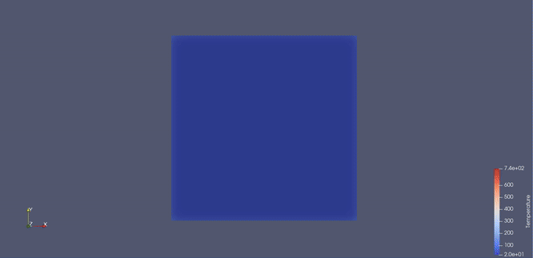
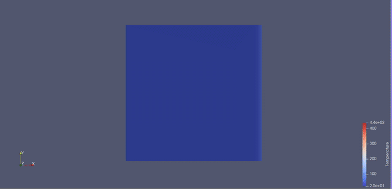

# FEM

Simple Finite Element Method solver, solving non-stationary heat transfer. Using rectangular shape functions von Neumann and Robin boundary boundary conditions. 
Loading configuration and mesh from .txt file.

It allows you to determine boundary conditions by inputting previously mentioned von Neumann and Robin bs.

## How to build 

Tou need a c/c++ compiler as well as CMAKE.

    mkdir build

    cd build

    cmake ..

    cmake --build .

    ./Debug/MES

    (or ./MES on linux)

## Text file

In order to use it you need a .txt configuration file, two examples are provided.

First part of the file is configuration details like simulation time, timestep, material data and number of nodes and elements.

Then there is a list of points with corresponding x and y coordinates.

Later is element list with ids of their nodes.

Last part is list of nodes with boundary conditions. First is node id, then there is flux (von Neumann bc), alfa and external temperature (both Robin argument).

## How to use

An example is provided in main.cpp. You simply create an object given a configuration file and then use .solve method.

There are two attributers to solve method, first is writing visualisation data to .vtu files (which can be viewed using Paraview), second is writing temperature data in time.

## To do

    -reading .nas files
